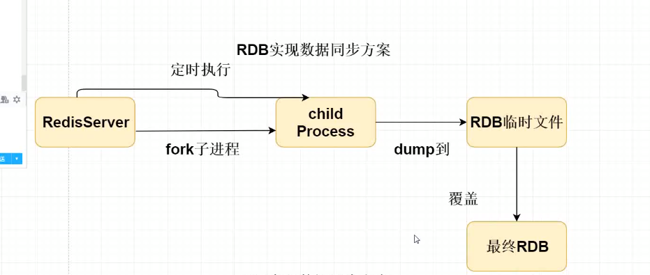
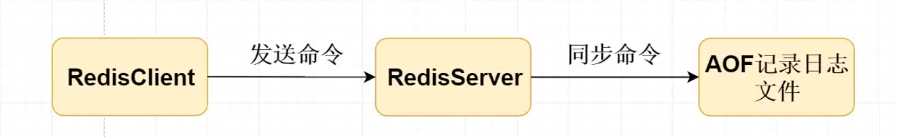

## MySQL与Redis数据一致性问题

- 手动刷新缓存。
- 在对数据进行修改操作时，同时操作数据库。
  - 先删除redis数据，再更新数据库
  - 先更新数据库，再更新redis
- 采用mq订阅mysql binlog日志文件增量同步到Redis中，保证数据最终一致（alibaba开源框架canal）。

## Redis持久化机制

- Redis的持久化机制有两种：AOF、RDB（默认），RDB采用定时持久化机制，但是服务器异常宕机后数据可能会丢失；AOF是基于数据日志操作实现的持久化，操作频率高，可以保证数据不丢失，但是增加服务的压力，同时会降低Redis的效率。

### RDB数据同步实现原理

Redis会将数据集的快照dump到dump.rdb文件中。此外，我们也可以通过配置文件来修改Redis服务器dump快照的频率，在打开redis.conf文件之后，我们搜索save可以看到下面的配置信息：

- save 900 1 # 在900s（15m）之后，如果至少有1个key发生变化，则dump内存快照。
- save 300 10 # 在300s（5m）之后，如果至少有10个key发生变化，则dump内存快照。
- save 60 10000 # 在60s（1m）之后，如果至少有 10000个key发生变化，则dump内存快照。

以上配置满足任一条件情况下，则会触发dump内存快照操作。

## AOF实现数据同步原理

将redis.conf中appendonly 值改为 yes即可开启AOF同步

AOF持久化机制存在三种同步策略，分别是

- appendfsync always # 每次有数据修改发生时，都会写入AOF文件，能够实时保证数据不会被丢失，效率会非常低。
  - 每一次写操作，都会执行同步命令至AOF文件内
- appendfsync everysec # 每秒同步一次，该策略为AOF的默认策略
  - 每一次写操作，将命令写入缓存区，每秒从缓冲区读取命令写入至AOF文件内
- appendfsync no # 从不同步。高效但是数据不会被持久化。

**AOF是将每一次写命令记录到aof文件中，通过持久化这些命令即可完成数据的恢复操作**

## RDB和AOF区别

- RDB属于全量同步，同步效率高，但是数据可能会丢失
- AOF属于增量同步，偏实时，会影响效率，但是数据最多只会丢失1s内的数据。
- 如果AOF与RDB都开启时，优先使用AOF

